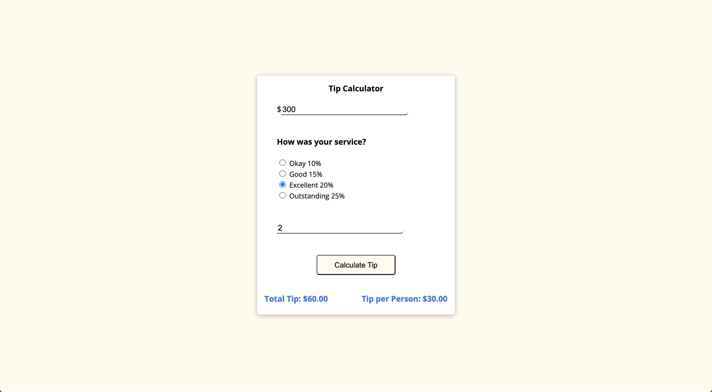

<h1>Tip Calculator App</h1>

<h4>This app lets you calculate a tip simply and with no calculations!</h4>

<a href="https://samod667.github.io/js-tip-calculator/"><h3>Live Demo</h3></a>

 

<ul>
<li>Insert the total bill amount</li>
<li>Choose the tip amount you would like to give (by the quality of service)</li>
<li>Insert how many people are splitting the bill</li>
<li>Get results for the full tip amount - and the tip amount needed to be payed by each person!</li>

ENJOY🏄🏻‍♂️
</ul>
